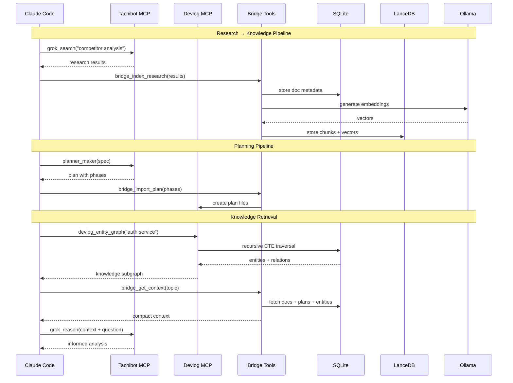
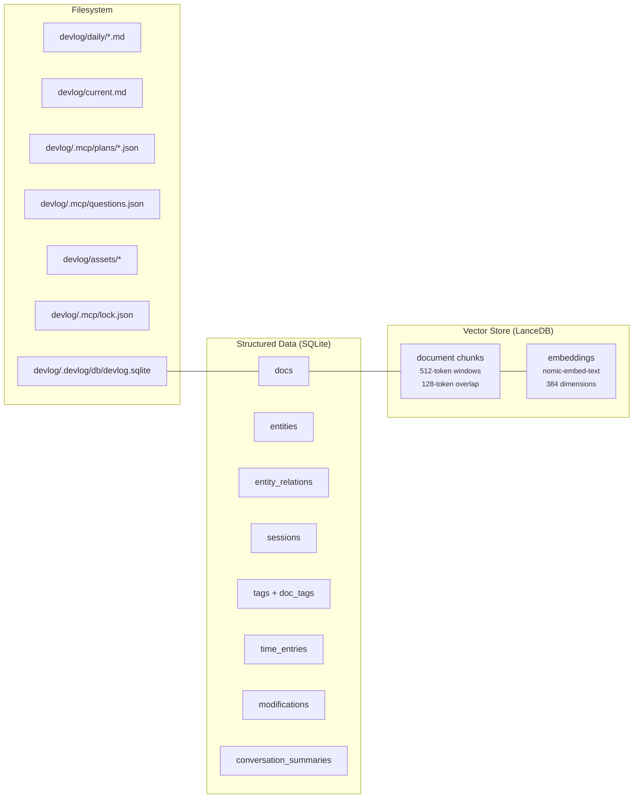

# Devlog MCP — Architecture

## System Overview

```mermaid
graph TB
    %% ─── Orchestrator ───
    CC["🖥️ Claude Code CLI"]

    %% ─── MCP Servers ───
    subgraph TACHIBOT["⚡ Tachibot MCP"]
        direction TB
        T_REASON["Reasoning<br/><small>grok_reason · openai_reason<br/>qwq_reason · kimi_thinking</small>"]
        T_SEARCH["Search & Research<br/><small>perplexity_ask · grok_search<br/>gemini_search · openai_search</small>"]
        T_CODE["Code Tools<br/><small>grok_code · qwen_coder<br/>kimi_code · minimax_code</small>"]
        T_PLAN["Planning<br/><small>planner_maker · planner_runner<br/>focus · jury · council</small>"]
        T_META["Meta<br/><small>think · nextThought<br/>prompt_techniques · workflows</small>"]
    end

    subgraph DEVLOG["📋 Devlog MCP"]
        direction TB
        subgraph CORE["Core Tools"]
            D_WS["Workspace<br/><small>claim · status · dump · session_log</small>"]
            D_PLAN["Plans<br/><small>create · check · blocker<br/>validate · status</small>"]
            D_Q["Questions<br/><small>add · answer · list · check</small>"]
            D_ASSET["Assets<br/><small>save_image · save_file · list</small>"]
        end
        subgraph KNOWLEDGE["Knowledge Layer"]
            D_ENTITY["Entity Graph<br/><small>entity_graph · entity_extract_deep</small>"]
            D_SEARCH["Semantic Search<br/><small>lancedb_search · hybrid FTS+vector<br/>RRF ranking</small>"]
        end
        subgraph BRIDGE["🔗 Bridge Tools"]
            B_IDX["bridge_index_research"]
            B_IMP["bridge_import_plan"]
            B_CTX["bridge_get_context"]
        end
    end

    %% ─── Storage ───
    subgraph STORAGE["💾 Storage Layer"]
        direction LR
        SQLITE[("SQLite<br/><small>docs · entities · relations<br/>sessions · tags · time</small>")]
        LANCE[("LanceDB<br/><small>vector embeddings<br/>semantic chunks</small>")]
        FS["📁 Filesystem<br/><small>daily/ · plans/ · assets/<br/>current.md · questions.json</small>"]
    end

    %% ─── External ───
    OLLAMA["🦙 Ollama<br/><small>nomic-embed-text · llama3.2</small>"]

    %% ─── Connections ───
    CC -->|"stdio JSON-RPC"| TACHIBOT
    CC -->|"stdio JSON-RPC"| DEVLOG

    T_SEARCH -.->|"research output"| B_IDX
    T_PLAN -.->|"plan phases"| B_IMP
    B_CTX -.->|"knowledge context"| T_REASON

    D_WS --> FS
    D_PLAN --> FS
    D_Q --> FS
    D_ASSET --> FS

    D_ENTITY --> SQLITE
    D_SEARCH --> LANCE
    D_WS -->|"workspace_dump"| SQLITE

    D_ENTITY -->|"deep extraction"| OLLAMA
    D_SEARCH -->|"embeddings"| OLLAMA

    B_IDX --> SQLITE
    B_IDX --> LANCE
    B_IMP --> FS
    B_CTX --> SQLITE

    %% ─── Styling ───
    classDef orchestrator fill:#1a1a2e,stroke:#e94560,color:#fff,stroke-width:3px
    classDef tachibox fill:#16213e,stroke:#0f3460,color:#e0e0e0
    classDef devlogbox fill:#1a1a2e,stroke:#533483,color:#e0e0e0
    classDef bridgebox fill:#2d1b4e,stroke:#e94560,color:#fff
    classDef storage fill:#0f3460,stroke:#53a8b6,color:#fff
    classDef external fill:#222,stroke:#e94560,color:#e94560,stroke-dasharray:5

    class CC orchestrator
    class T_REASON,T_SEARCH,T_CODE,T_PLAN,T_META tachibox
    class D_WS,D_PLAN,D_Q,D_ASSET,D_ENTITY,D_SEARCH devlogbox
    class B_IDX,B_IMP,B_CTX bridgebox
    class SQLITE,LANCE,FS storage
    class OLLAMA external
```

## Data Flow

## Storage Architecture

## Architecture Assessment

**Rating: 7.5/10**

### Strengths

| Aspect | Detail |
|--------|--------|
| **Separation of concerns** | Tachibot = multi-model AI reasoning. Devlog = structured knowledge. No overlap. |
| **Bridge pattern** | 3 opt-in tools create a clean integration boundary. Zero cost when disabled. |
| **Layered storage** | SQLite (structured), LanceDB (vectors), filesystem (human-readable). Each plays to its strength. |
| **Graceful degradation** | Without Ollama: regex entity extraction works, semantic search unavailable. |
| **Incremental indexing** | SHA-256 content hashing skips unchanged docs. |
| **Modular servers** | core (minimal), unified (all), specialty (search, planning, analytics). |

### Areas to Sharpen

| Concern | Impact | Suggestion |
|---------|--------|------------|
| **42-tool surface area** | Taxes LLM attention window | Dynamic tool discovery or grouping |
| **3 sources of truth** | Plans in JSON files, docs in SQLite, vectors in LanceDB — sync risk | Make SQLite the single source, generate files from it |
| **Ollama-only embeddings** | Ties semantic search to local service | Add fallback provider (OpenAI, local ONNX) |
| **Unidirectional bridge** | Research lost if `bridge_index_research` not called | Auto-bridge via hook or event |
| **File-based locking** | Single lock holder, no multi-user support | Entity graph has `users` table but locking doesn't scale |
